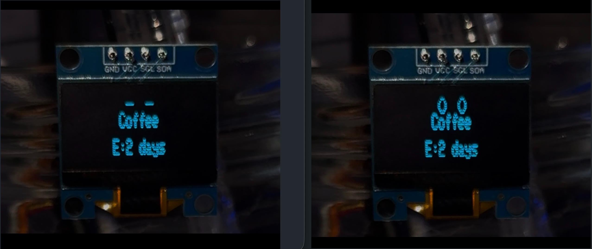
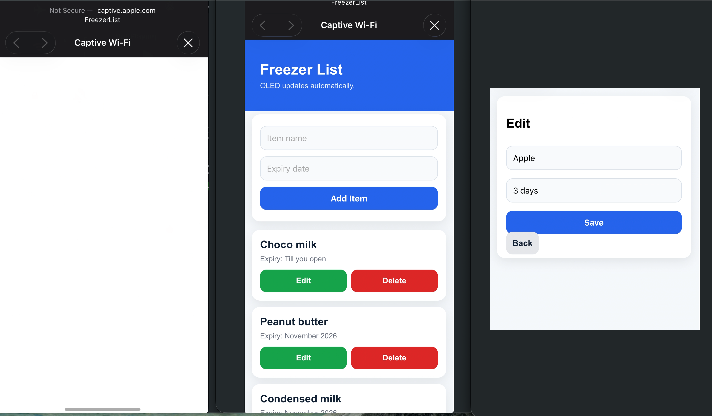

# 🤖 Freezer Robot
A tiny smart companion for your fridge that helps you track what's inside, avoid duplicate shopping, and reduce food waste.

---

## Why I Built This

I kept forgetting what was already in my fridge.

One day, I found:
- Litchi gone moldy after wasting money.
- Syrup, jam, and peanut butter sitting there for months.
- Myself opening the fridge hoping there was nothing inside — but there always was.

Every time I went grocery shopping, I'd forget what I already had. That meant buying duplicates, wasting food, and wasting money.

So I built Freezer Robot: a small fridge-mounted device that shows what's inside, lets me manage items from my phone, and makes the whole process a little more fun.

---

## This Isn't Just My Problem

Students living alone. Busy professionals. Anyone who cooks irregularly or shops without a list.

We all do the same thing: buy groceries without knowing what's already there, find something expired two weeks later, feel guilty, repeat.

The standard solutions don't work:
- **Phone reminders** — you set them once, ignore them, delete them
- **Fridge whiteboards** — you forget to update them after day three
- **Grocery apps** — too much friction to maintain daily

The problem isn't that people don't care. It's that every existing solution requires you to *remember to use it.*

Freezer Robot is passive. It sits on the fridge. You see it every time you walk past.

---

## The Real Insight

The fridge is already the thing you check before you cook or shop.

You open it, stare at it, close it. Sometimes twice.

So the information should live *on the fridge* — not in your phone, not in an app, not in a list you have to remember to open.

That's the whole idea. Put the inventory exactly where the behaviour already happens. No new habit required.


---

### See It In Action






---

## What It Does

Freezer Robot is built with an ESP32 and a 0.96" OLED display. It:

- Displays fridge/freezer items on a tiny screen.
- Shows a cute robot face when running.
- Cycles through stored items automatically.
- Lets you add, edit, and delete items from your phone.
- Saves data locally, so it survives power loss.
- Creates its own Wi‑Fi hotspot, so no internet is needed.

The idea is simple: check the screen before you cook or shop, and waste less food.

---

## Why These Choices

A phone app would have been easier to build. A Notion list would have taken five minutes.

But both require you to *remember to open them.* The whole problem is that you forget.

A physical screen on the fridge is always visible. No app to open, no notification to dismiss. It's just there — the same way a sticky note is more reliable than a reminder.

That's why this is hardware, not software.

The other constraints were intentional too:
- **No internet required** — a fridge device that needs your home WiFi to work is fragile. Hotspot means it works anywhere, always.
- **Tiny screen** — forces the display to show only what matters. No clutter.
- **Web interface instead of an app** — nothing to install. Anyone with a phone can use it in 30 seconds.

---

## Hardware

| Component | Quantity | Unit Price | Total | Purpose |
|-----------|----------|------------|-------|---------|
| ESP32 Dev Board (Wi‑Fi + Bluetooth) | 1 | ₹650 | ₹650 | Main controller |
| 0.96" OLED Display (I2C SSD1306) | 1 | ₹200 | ₹200 | Tiny display |
| 3.7V LiPo Battery (1000mAh) | 1 | ₹299 | ₹299 | Portable power |
| TP4056 Charging Module | 1 | ₹55 | ₹55 | Battery charging |
| Jumper Wires Pack | 1 | ₹150 | ₹150 | Wiring |
| Push Button Pack | 1 | ₹59 | ₹59 | Wake/sleep |
| Magnetic Squares Pack | 1 | ₹399 | ₹399 | Mounting on fridge |
| Delivery Fees | - | - | ₹150 | Shipping |

**Minimum viable build:** ~₹1200–₹1300  
**My actual cost:** ~₹2000 (bought extras and spares for future projects)

---

## Wiring

### OLED to ESP32

| OLED Pin | ESP32 Pin |
|----------|-----------|
| GND | GND |
| VCC | 3.3V |
| SCL | GPIO 22 |
| SDA | GPIO 21 |

Use jumper wires and double-check connections before powering on.

---

## How to Build It

**1. Install the tools**
- Download Arduino IDE
- Install the ESP32 board package
- Install Adafruit GFX and Adafruit SSD1306 libraries

**2. Wire the hardware**
- Connect the OLED to the ESP32 using the wiring table above
- If using battery power later, connect the charging module carefully

**3. Upload the code**
- Open the `.ino` file in Arduino IDE
- Select your ESP32 board and correct port
- Upload the sketch

**4. Connect to the hotspot**
- On your phone, connect to `FreezerList`
- Password: `12345678`
- Open the web page and start adding items

**5. Mount it on the fridge**
- Stick magnetic squares to the back
- Place at eye level
- Power with USB or battery

---

## How to Use It

1. Open the web page from your phone
2. Add an item name and expiry date
3. Check the OLED screen before shopping or cooking
4. Edit or delete items when used up

---

## Results (First Month)

I stopped buying things I already had. That's the behaviour that changed.

Before: open fridge, guess, go shopping, come home with duplicates.  
After: check the screen, know exactly what's there, buy only what's missing.

Specific things I caught: 2 condiments about to expire that I actually used. One unnecessary grocery run I skipped.

Estimated savings: ₹500–1000/month — not from coupons or budgeting, just from not wasting what I already paid for.

The robot face helped too. It made me *want* to check it.

---

## What I Learned

- Hardware can be fun and surprisingly satisfying
- Small constraints force better design
- Solving your own problem first is a great way to build something useful
- Put the solution where the behaviour already happens — not where you think people will look
- Testing with real use is more valuable than guessing
- Using AI as a coding and writing assistant is just using a tool well

---

## Future Ideas

- Better robot expressions
- Motion sensor — lights up when fridge opens
- Expiry countdown warnings
- Shopping list sync
- Multi-user support
- Battery optimisation and sleep mode
- Cleaner 3D-printed case

---

## Project Structure

```
freezer-robot/
├── README.md
├── freezer-robot.ino
├── PARTS_LIST.md
├── WIRING.md
└── photos/
```

---

## FAQ

**How much does it cost?**  
About ₹2000 with extras, or ₹1200–₹1300 for a basic build.

**How long does it take to build?**  
Roughly 2–3 hours for wiring, uploading, and testing.

**Does it need Wi‑Fi?**  
No. It creates its own hotspot.

**How long does the battery last?**  
Around 5–7 days in its current form.

**Can I customise it?**  
Yes. The project is open source and easy to adapt.

---

## Resources

- [Random Nerd Tutorials - ESP32 OLED](https://randomnerdtutorials.com/esp32-ssd1306-oled-display-arduino-ide/)
- [Adafruit GFX Documentation](https://learn.adafruit.com/adafruit-gfx-graphics-library)
- [Arduino Official Docs](https://www.arduino.cc/reference/en/)

---

## License

Open source. Use it, modify it, share it, build your own version.

---

**Built with ❤️ by Navneet** | June 2026 | First Hardware Project
